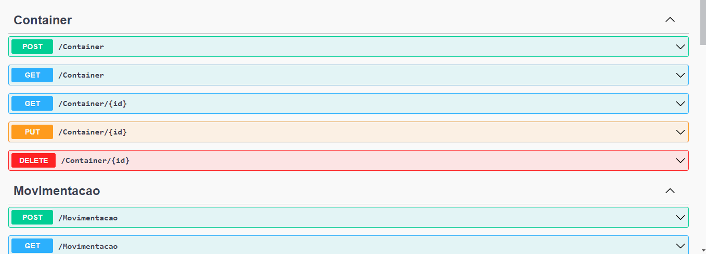
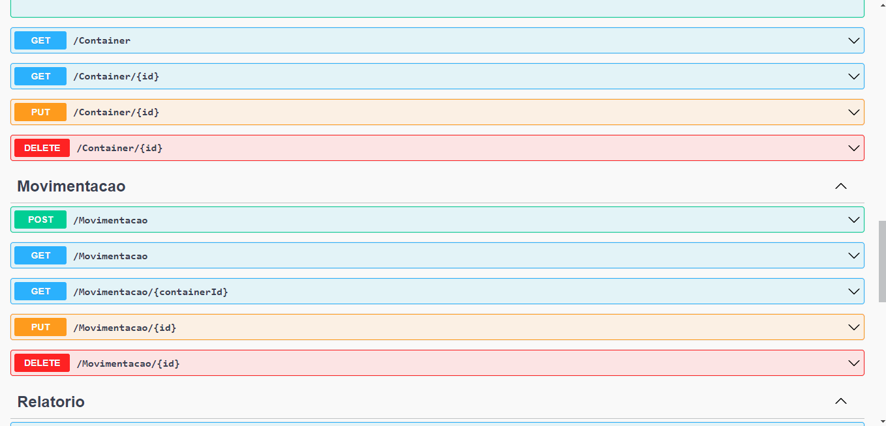
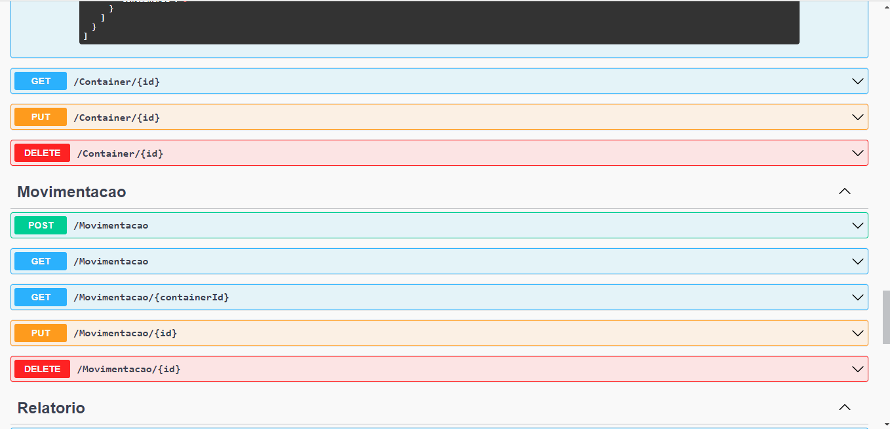
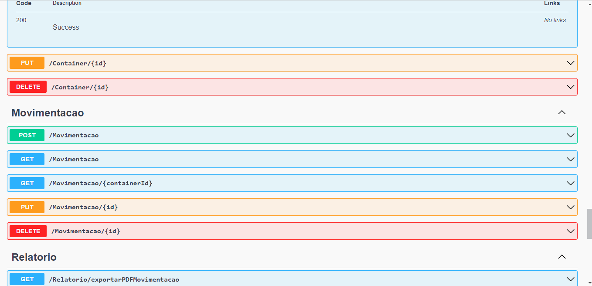
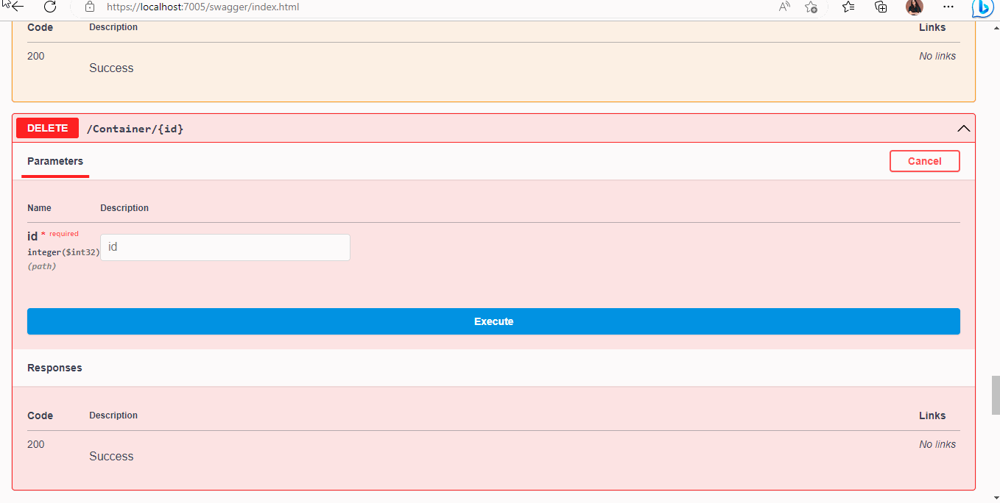
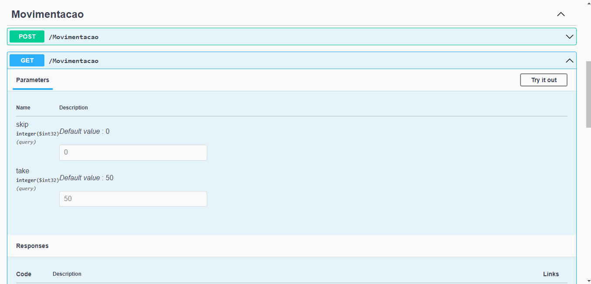
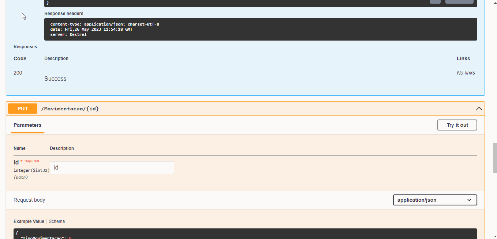
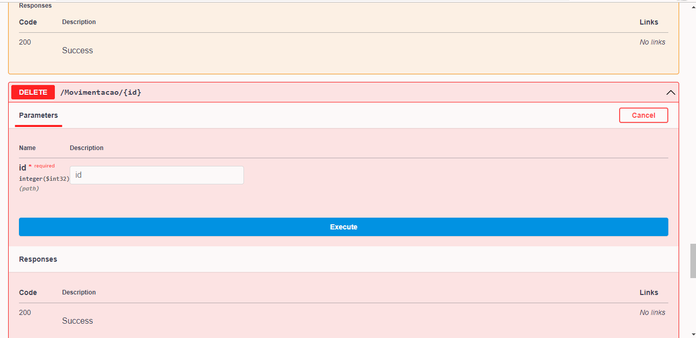
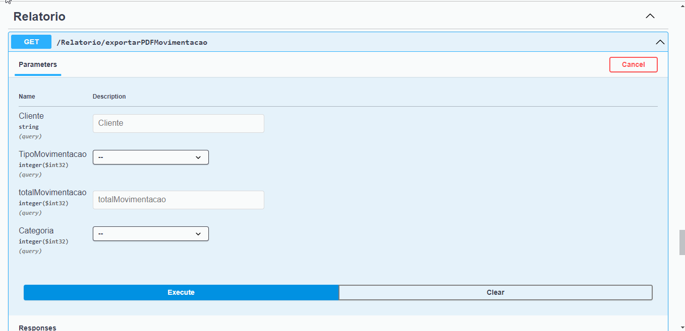

## 💻 Sobre o projeto

Este projeto consiste em uma API para um Sistema Portuário Fictício. Onde os Containers podem ser cadastrados de acordo com seu 
cliente. E cada Container contém um conjunto de movimentações, que correspondem ao número de vezes que aquele container foi 
movimentado. E ao solicitar, o usuário pode obter um relatório com o total de movimentações feita.

---

## ⚙️ Funcionalidades

- [x] CRUD de Container;
- [x] CRUD de Movimentação;>
- [X] Emissão do Relatório (base64 => PDF);

---

## 📄 Documentação

A documentação das funcionalidades da aplicação pode ser acessada neste link: <a href="https://tinted-editor-613.notion.site/TESTE-PR-TICO-1556a1348cd8440fb32c2e76043baec1">Notion</a>

---

## 🛠 Tecnologias

As seguintes tecnologias foram utilizadas no desenvolvimento da API Rest do projeto:

- **[C#](https://www.devmedia.com.br/guia/linguagem-csharp/38152#:~:text=C%23%20%C3%A9%20uma%20linguagem%20de,a%20programa%C3%A7%C3%A3o%20Orientada%20a%20Objetos.)**
- **[ASP .NET Core](https://en.wikipedia.org/wiki/ASP.NET_Core)**
- **[Angular](https://pt.wikipedia.org/wiki/Angular_(framework))**
- **[Dapper](https://en.wikipedia.org/wiki/Dapper_ORM)**
- **[ITextSharp](https://en.wikipedia.org/wiki/IText)**
- **[Base64](https://pt.wikipedia.org/wiki/Base64)**
- **[MySql](https://www.mysql.com/)**
- **[Entity Framework Core](https://pt.wikipedia.org/wiki/Entity_Framework)**

---

## 📝 CRUD 

# CONTAINER 

# POST 

# GET 

# GET ID

# PUT  

# DELETE 

# MOVIMENTAÇÃO 

# POST 

# GET + GED ID 

# PUT  

# DELETE 

# RELATÓRIO 

---
